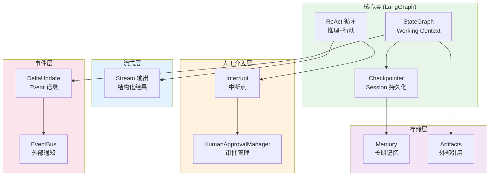

# 多Agent架构原则 (基于 Google ADK)

**版本: 1.0 | 2026-03-27**

> 参考: [Google ADK: Architecting Efficient Context-Aware Multi-Agent Framework](https://developers.googleblog.com/architecting-efficient-context-aware-multi-agent-framework-for-production/)

---

## 核心设计理念

```
❌ 旧方式: Context 作为可变字符串缓冲区 (prompt gymnastics)
✅ 新方式: Context 作为分层有状态系统的编译视图 (systems engineering)
```

---

## 1. Context 管理

### 1.1 核心原则
```
Storage (持久化) ≠ Presentation (呈现)

Session (会话): 持久化状态，所有交互作为强类型 Event 记录
Working Context (工作上下文): 每次调用的计算投影，临时、可配置
```

### 1.2 LangGraph 中的实现
```
✅ StateGraph State = Working Context
✅ Checkpointer = Session 持久化
✅ DeltaUpdate = Event 记录
```

---

## 2. Agent 协作模式

### 2.1 两种主要模式

| 模式 | 描述 | 适用场景 |
|------|------|----------|
| **Agents as Tools** | 根 Agent 把子 Agent 当函数调用，获取结果后继续 | 简单任务分解 |
| **Agent Transfer** | 完全移交控制权，子 Agent 继承有限上下文视图 | 复杂多轮协作 |

### 2.2 上下文移交 (Scoped Handoffs)
```
控制哪些上下文流向子 Agent:

include_contents: [intent_chain, current_goal]  # 仅必要的
exclude: [internal_reasoning, raw_history]     # 排除敏感的

子 Agent 收到最小必要上下文，而非完整历史
```

### 2.3 LangGraph Send API
```
# 并行执行多个子 Agent
return [Send("executor", {"goal_id": g}) for g in goals]

# 子 Agent 继承父图的 checkpointer 命名空间
```

---

## 3. ReAct + Stream + Interrupt 整合

### 3.1 ReAct 模式 (核心推理)
```
┌─────────────────────────────────────────────────────┐
│                  ReAct 循环                          │
│  Thought → Action → Observation → ... → Output    │
│                                                      │
│  ✅ 完整执行保证推理一致性                            │
│  ✅ 工具调用和格式校验在循环内完成                    │
└─────────────────────────────────────────────────────┘
```

### 3.2 Stream 分离 (外层展示)
```
┌─────────────────────────────────────────────────────┐
│  ReAct 循环 (内部)          │  Stream (外部)         │
│  ─────────────────────────  │  ─────────────────── │
│  完整推理 + 工具调用          │  最终结构化结果输出    │
│  格式校验 + 错误处理          │  实时 token 显示      │
│                              │                       │
│  ✅ 内部完整执行              │  ✅ 用户可见结果       │
└─────────────────────────────────────────────────────┘
```

### 3.3 Interrupt (HITL 人工介入)
```
┌─────────────────────────────────────────────────────┐
│              Interrupt 中断点                        │
│                                                       │
│  executor_node → interrupt("请确认...")              │
│       ↓                                              │
│  Checkpointer 保存状态                               │
│       ↓                                              │
│  用户审批 → Command(resume={...})                    │
│       ↓                                              │
│  恢复执行                                            │
└─────────────────────────────────────────────────────┘
```

---

## 4. 长对话支持

### 4.1 Context 压缩
```
触发阈值: Token 达到 context window 80%

压缩策略:
  1. LLM 异步摘要旧事件
  2. 摘要后删除原始事件
  3. 保留关键决策点
```

### 4.2 Artifacts 模式
```
大型数据 (文件、日志、图片) → 外部存储
通过引用 (name/version) 访问
Agent 按需加载，完成后卸载
```

### 4.3 Memory Layer
```
长期记忆: 用户偏好、历史决策
跨会话持久化
Agent 主动召回 (reactive) 或预加载 (proactive)
```

---

## 5. 性能优化

### 5.1 Context 缓存
```
┌────────────────────────────────────────┐
│  Context 结构                           │
├────────────────────────────────────────┤
│  [Static Prefix]  ← 系统指令，可缓存    │
│  [Variable Suffix] ← 最新轮次，动态    │
└────────────────────────────────────────┘

Pipeline 排序保证可复用内容在 context 前部
```

### 5.2 静态指令
```
系统提示词 = 不可变
保证 Checkpointer cache prefix 有效性
```

### 5.3 确定性过滤
```
全局规则预过滤:
  - 移除超长输出
  - 截断历史到 N 轮
  - 丢弃特定类型事件
```

---

## 6. 架构整合图



---

## 7. 实现 Checklist

- [x] LangGraph StateGraph 作为编排框架
- [x] ReAct Agent 基类 (BaseReActAgent)
- [x] stream() 分离设计
- [x] interrupt() + HITL 审批
- [x] Checkpointer 持久化
- [x] DeltaUpdate 外部通知
- [ ] Memory Layer 长期记忆
- [ ] Context 压缩
- [ ] Artifacts 外部存储
