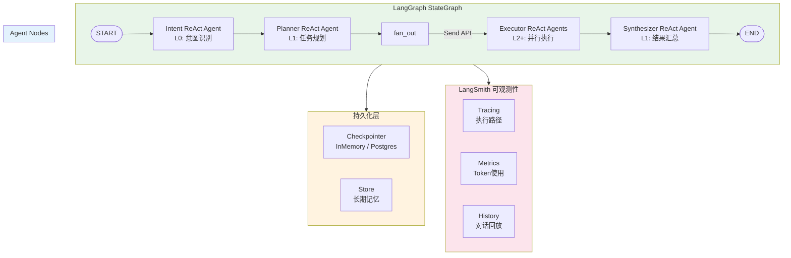
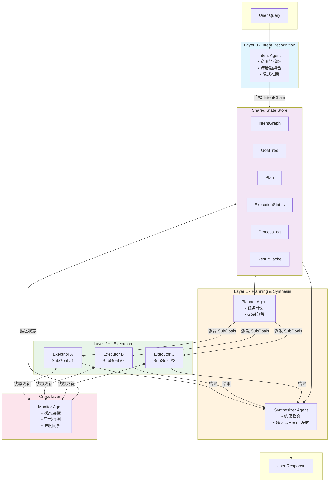
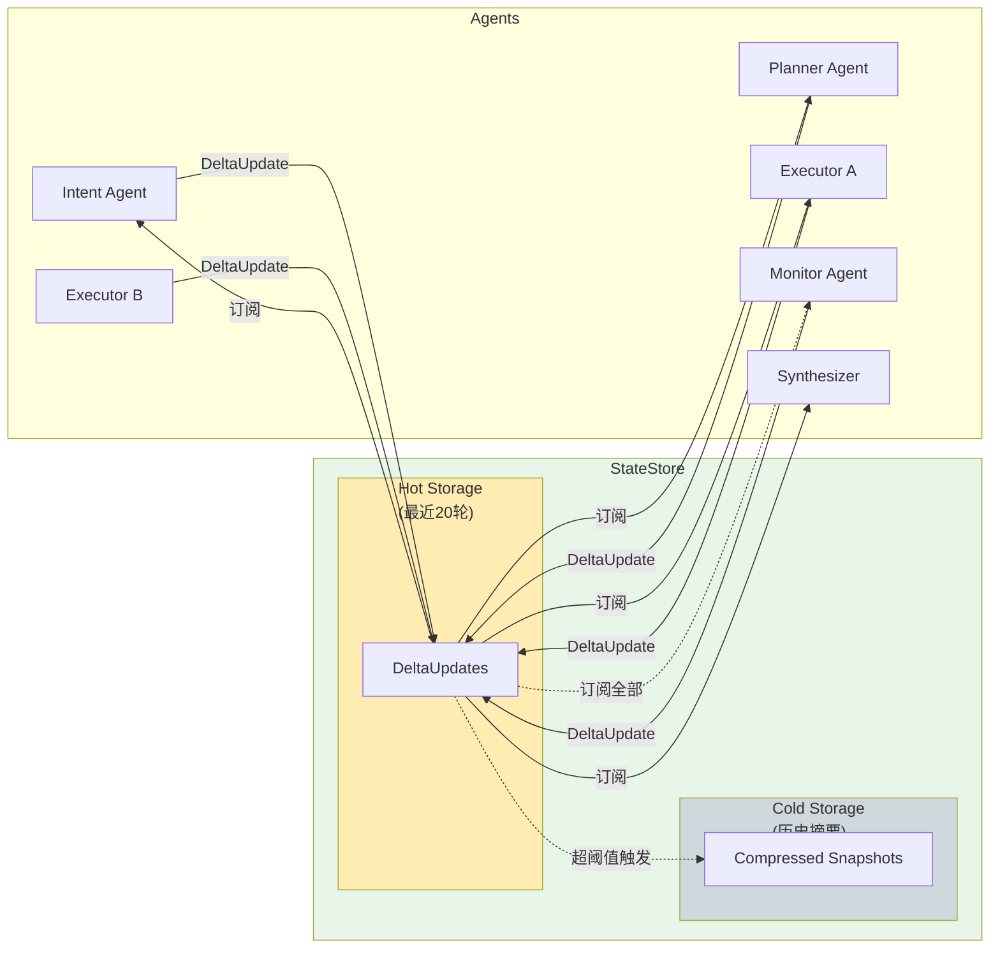
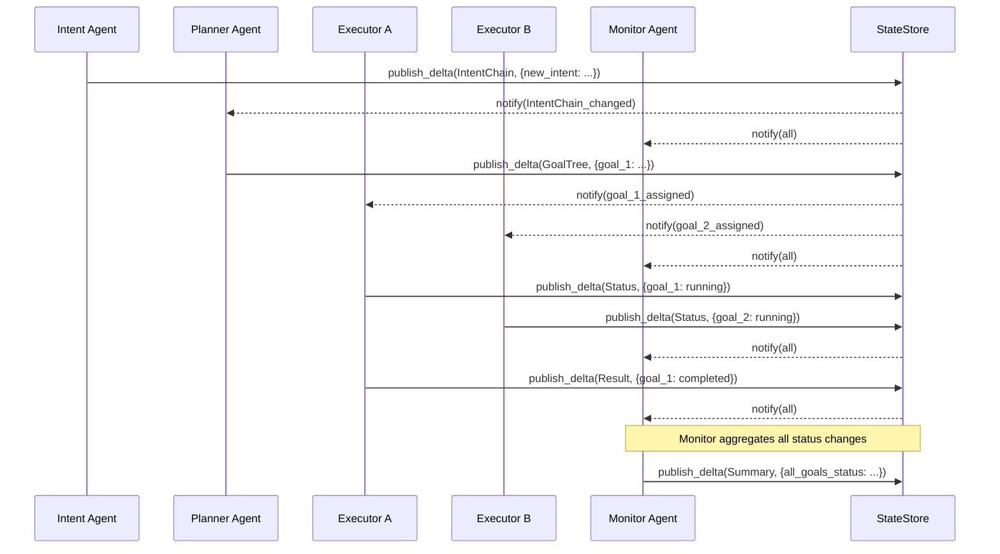
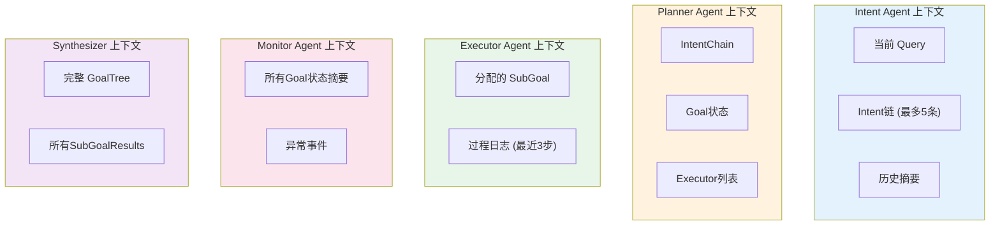
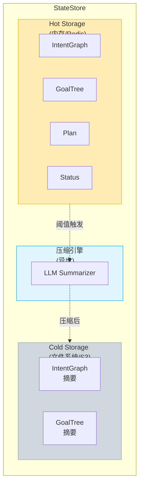
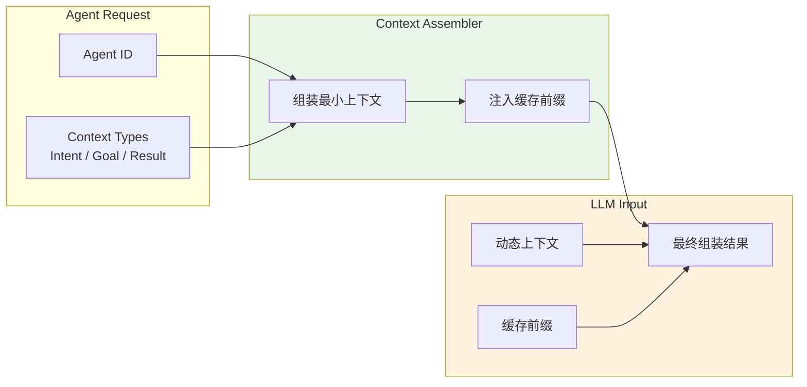
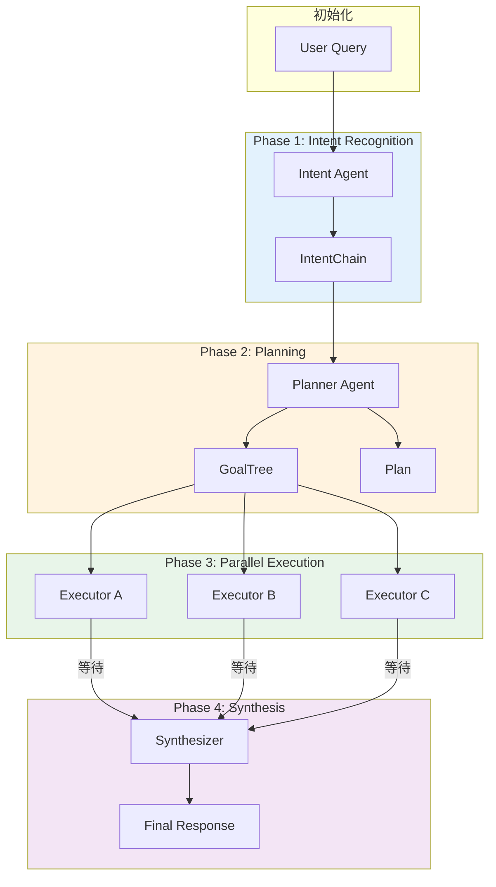
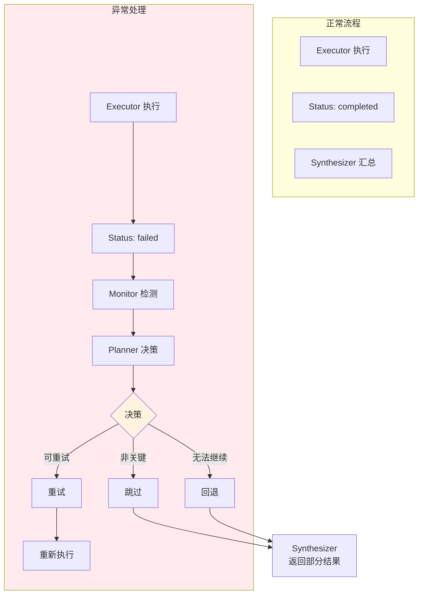

# 多层级多Agent协作系统设计文档

**作者：Hangfei Lin | 2026年3月27日**

## 1. 设计背景

基于 Google ADK 上下文感知框架的设计理念，构建一套适用于通用AI应用的多层级多Agent协作系统。核心需求：

- 多Agent协作流水线：意图识别 → 任务计划 → 子目标执行 → 结果汇总
- 全量状态同步：上下文、任务、资源、工具全部共享
- 长对话支持（50+轮）：Token线性增长，不爆炸
- 低延迟 + 低Token消耗的平衡优化
- **基于 LangGraph 框架实现 ReAct Agent**
- **集成 LangSmith 实现可观测性**

---

## 2. 框架架构 (LangGraph + LangSmith)

### 2.1 LangGraph 编排架构 (Mermaid)



### 2.2 ReAct Agent 模式

```
ReAct (Reasoning + Acting) 循环:

┌─────────────────────────────────────────────────────┐
│                    Thought                          │
│   "我需要理解用户的意图，提取关键实体..."              │
└─────────────────────┬───────────────────────────────┘
                      │
                      ▼
┌─────────────────────────────────────────────────────┐
│                    Action                          │
│   调用工具: query_knowledge_base(query)             │
└─────────────────────┬───────────────────────────────┘
                      │
                      ▼
┌─────────────────────────────────────────────────────┐
│                  Observation                        │
│   检索结果: [entity_1, entity_2, confidence: 0.9]   │
└─────────────────────┬───────────────────────────────┘
                      │
                      ▼
              继续循环或结束
```

### 2.3 流式输出架构

```
Client                    LangGraph                    LLM
  │                          │                        │
  │──── stream(query) ──────>│                        │
  │                          │──── invoke ────────────>│
  │                          │<─── tokens ────────────│
  │<──── chunk ──────────────│                        │
  │                          │                        │
  │                          │<─── tokens ────────────│
  │<──── chunk ──────────────│                        │
  │                          │                        │
  │              (实时流式输出)                        │
```

---

## 3. 系统架构

### 3.1 整体架构图 (Mermaid)



### 3.2 ASCII 架构图 (兼容性版本)

```
┌──────────────────────────────────────────────────────────────────────┐
│                        Multi-Agent Collaboration                       │
│                                                                       │
│  User Query ───────────────────────────────────────────────────────▶ │
│      │                                                                │
│      ▼                                                                │
│  ┌──────────────────────────────────────────────────────────────┐     │
│  │              Intent Agent (L0 - Intent Recognition)            │     │
│  │  • 多轮意图链追踪                                              │     │
│  │  • 跨话题上下文聚合                                            │     │
│  │  • 隐式意图推断                                                │     │
│  │  输出: IntentChain { current_intent, history, confidence }    │     │
│  └──────────────────────────────┬───────────────────────────────┘     │
│                                 │ 广播 IntentChain                    │
│                                 ▼                                     │
│  ┌──────────────────────────────────────────────────────────────┐     │
│  │              Planner Agent (L1 - Task Orchestration)         │     │
│  │  • 基于 IntentChain 制定任务计划                              │     │
│  │  • 分解为 Goal Tree                                          │     │
│  │  输出: Plan { goals[], execution_order, dependencies[] }       │     │
│  └──────────────────────────────┬───────────────────────────────┘     │
│                                 │ 派发 SubGoals                       │
│                    ┌────────────┼────────────┐                         │
│                    ▼            ▼            ▼                       │
│  ┌─────────────┐  ┌─────────────┐  ┌─────────────┐                       │
│  │ Executor A  │  │ Executor B  │  │ Executor C  │  (L2+)               │
│  │ SubGoal #1  │  │ SubGoal #2  │  │ SubGoal #3  │                       │
│  └──────┬──────┘  └──────┬──────┘  └──────┬──────┘                       │
│         │               │               │                              │
│         └───────────────┼───────────────┘                              │
│                         ▼ 状态更新                                      │
│  ┌──────────────────────────────────────────────────────────────┐      │
│  │              Monitor Agent (Cross-layer - Process Tracking)  │      │
│  │  • 实时监控子目标执行状态                                       │      │
│  │  • 异常检测                                                    │      │
│  │  • 进度同步                                                    │      │
│  │  输出: StatusUpdates → StateStore & UI                       │      │
│  └──────────────────────────────┬───────────────────────────────┘      │
│                                 │                                      │
│                                 ▼                                      │
│  ┌──────────────────────────────────────────────────────────────┐      │
│  │              Synthesizer Agent (L1 - Result Mapping)         │      │
│  │  • 聚合子目标结果                                              │      │
│  │  • 映射 Goal → Result                                         │      │
│  │  • 生成最终响应                                                │      │
│  └──────────────────────────────┬───────────────────────────────┘      │
│                                 │                                      │
│                                 ▼                                      │
│                         User Response                                  │
└──────────────────────────────────────────────────────────────────────┘
```

### 3.3 状态同步架构 (Mermaid)



---

## 3. Agent 职责矩阵

| Agent | 层级 | 输入 | 输出 | 协作方式 |
|-------|------|------|------|----------|
| **Intent Agent** | L0 | User Query + History | IntentChain | 广播 IntentChain 给所有 Agent |
| **Planner Agent** | L1 | IntentChain | Plan + GoalTree | 派发 SubGoal 给 Executor |
| **Executor Agent** | L2+ | SubGoal | ExecutionResult | 报告状态给 Monitor |
| **Monitor Agent** | 跨层 | 各 Agent 状态 | StatusUpdate | 推送状态到 StateStore |
| **Synthesizer Agent** | L1 | SubGoal Results | FinalResponse | 订阅 GoalTree 完成事件 |

---

## 4. 核心数据模型

### 4.1 IntentChain (意图链)

```typescript
interface IntentNode {
  id: string;
  intent: string;                    // 意图描述
  entities: Record<string, any>;      // 提取的实体
  confidence: number;                 // 置信度 0-1
  parentId: string | null;           // 父意图引用
  createdAt: number;                  // 时间戳
  status: 'active' | 'completed' | 'abandoned';
}

interface IntentChain {
  chainId: string;
  nodes: IntentNode[];               // 意图链节点
  currentNodeId: string;             // 当前活跃意图
  crossTopicRefs: string[];          // 跨话题引用
}
```

### 4.2 GoalTree (目标树)

```typescript
interface Goal {
  id: string;
  type: string;                      // goal type
  description: string;
  params: Record<string, any>;
  parentId: string | null;          // 父目标
  status: 'pending' | 'in_progress' | 'completed' | 'failed';
  assignedTo: string | null;        // 分配的 Executor
  result?: any;                      // 执行结果
  processLog: ProcessStep[];         // 过程日志
  createdAt: number;
  completedAt?: number;
}

interface GoalTree {
  rootGoalId: string;
  goals: Map<string, Goal>;
  dependencies: Map<string, string[]>; // goalId -> [dependentGoalIds]
}
```

### 4.3 Plan (任务计划)

```typescript
interface Plan {
  planId: string;
  intentChainRef: string;           // 关联的意图链
  executionOrder: string[];          // 执行顺序的 Goal ID 列表
  dependencies: Map<string, string[]>; // 依赖关系
  estimatedCost: number;             // 预估 Token 消耗
  createdAt: number;
}
```

### 4.4 ExecutionStatus & ProcessLog

```typescript
interface ExecutionStatus {
  goalId: string;
  executorId: string;
  status: 'queued' | 'running' | 'waiting' | 'completed' | 'failed';
  progress: number;                  // 0-100
  lastUpdate: number;
}

interface ProcessStep {
  stepId: string;
  goalId: string;
  action: string;
  input: any;
  output?: any;
  timestamp: number;
  agentId: string;
}
```

---

## 5. 状态同步机制

### 5.1 增量状态同步 (Delta Sync) - Mermaid



### 5.2 DeltaUpdate 数据结构

```typescript
interface DeltaUpdate {
  eventId: string;                  // 唯一ID
  timestamp: number;                 // Unix timestamp
  entityType: 'Intent' | 'Goal' | 'Plan' | 'Status' | 'Result';
  entityId: string;                 // 实体ID
  operation: 'create' | 'update' | 'delete';
  changedKeys: string[];            // 变化的字段
  delta: Record<string, any>;        // 变化的部分
  sourceAgent: string;              // 发起更新的Agent
}
```

### 5.3 上下文作用域控制 - Mermaid



### 5.4 长对话 Token 控制策略

```
每个 Agent 只看到必要上下文：

Intent Agent:     [当前 Query] + [近期 Intent 链(最多5条)] + [压缩的历史摘要]
Planner Agent:    [IntentChain] + [当前 Goal 状态] + [可用 Executor 列表]
Executor Agent:   [分配给自己的 SubGoal] + [必要的过程日志(最近3步)]
Monitor Agent:     [所有 Goal 的 Status 摘要] + [异常事件]
Synthesizer:      [完整 GoalTree] + [所有 SubGoalResults]
```

### 5.3 长对话 Token 控制策略

| 对话阶段 | Token 策略 |
|----------|-----------|
| **0-20 轮** | 全量同步，所有 Agent 看到完整上下文 |
| **20-50 轮** | 启用压缩，Intent 链保留最近 5 条，历史转为摘要 |
| **50 轮+** | 增量同步 + LLM 异步压缩旧上下文 |

---

## 6. StateStore 设计

### 6.1 分层存储 - Mermaid



### 6.2 Context Assembler - Mermaid



### 6.3 分层存储 (ASCII)

```
┌─────────────────────────────────────────────────────┐
│                   StateStore                         │
│                                                      │
│  Hot Storage:                                        │
│    • 最近 20 轮的完整数据                            │
│    • 快速读写 (< 10ms)                              │
│    • 内存/Redis                                      │
│                                                      │
│  Cold Storage:                                       │
│    • 更早的历史摘要 (低 Token 快照)                   │
│    • 低频访问                                       │
│    • 文件系统/S3                                     │
│                                                      │
│  压缩触发: 当 Hot Storage > 阈值时，                  │
│          异步压缩最旧数据到 Cold Storage             │
└─────────────────────────────────────────────────────┘
```

### 6.4 Context Assembler (ASCII)

```
每个 Agent 调用前:

1. 声明需要的上下文类型 (Intent / Goal / Result)
2. ContextAssembler 根据声明组装最小上下文
3. 注入 <static> 缓存前缀 (系统指令等)

ContextAssembly {
  agentId: string;
  requestContext: RequestContext;  // 本次请求相关
  cachedContext: string;           // 可复用的缓存前缀
  assembled: string;               // 最终组装结果
  tokenCount: number;
}
```

---

## 7. 执行流水线

### 7.1 并行执行示意 - Mermaid

```mermaid
gantt
    title 多Agent执行流水线
    dateFormat X
    axisFormat %s

    section Intent
    Intent Agent          :active, ia, 0, 1

    section Plan
    Planner Agent         :active, pa, 1, 2

    section Execute
    Executor A            :active, ea, 2, 5
    Executor B            :active, eb, 2, 4
    Executor C            :active, ec, 2, 3

    section Synthesize
    Synthesizer Agent     :active, sa, 5, 6
```



### 7.2 执行流程 - Mermaid



### 7.3 异常处理流程 - Mermaid



### 7.4 并行执行示意 (ASCII)

```
                    User Query
                         │
                         ▼
              ┌─────────────────────┐
              │   Intent Agent (L0) │  ← 单线程，依赖前序结果
              │   ~200-500 tokens   │
              └──────────┬──────────┘
                         │ IntentChain
                         ▼
              ┌─────────────────────┐
              │   Planner Agent      │  ← 单线程
              └──────────┬──────────┘
                         │ Plan + GoalTree
            ┌────────────┼────────────┐
            ▼            ▼            ▼
     ┌───────────┐ ┌───────────┐ ┌───────────┐
     │Executor A │ │Executor B │ │Executor C │  ← 三者并行执行
     │(SubGoal 1)│ │(SubGoal 2)│ │(SubGoal 3)│
     └─────┬─────┘ └─────┬─────┘ └─────┬─────┘
           │             │             │
           └─────────────┼─────────────┘
                         ▼
              ┌─────────────────────┐
              │   Synthesizer Agent │  ← 等待所有子结果
              └─────────────────────┘
```

### 7.5 异常处理与重试 (ASCII)

```
Executor 失败:
  1. Monitor 检测到 StatusUpdate (status: 'failed')
  2. Monitor 通知 Planner
  3. Planner 决定: 重试 / 跳过 / 回退
  4. 更新 GoalTree 状态
  5. 重新调度执行

超时处理:
  • 单个 Executor 超时: 标记为 failed，触发重试流程
  • 全局超时: Synthesizer 返回部分结果 + 状态说明
```

---

## 8. 技术选型

| 组件 | 技术选型 | 原因 |
|------|----------|------|
| **Agent 框架** | LangGraph | 状态图定义清晰，支持复杂流程 |
| **状态存储** | Redis + SQLite | 热数据高速访问 + 持久化 |
| **消息队列** | In-Memory Event Bus | 低延迟，减少外部依赖 |
| **LLM 调用** | Anthropic Claude API | 高效上下文处理 |
| **上下文压缩** | LLM 异步摘要 | 保证压缩质量 |

---

## 9. 预期性能指标

| 指标 | 目标值 |
|------|--------|
| 单次 Query Token | 8K-15K |
| 端到端延迟 | < 5s (并行执行) |
| 长对话(100轮) Token | 线性增长，无指数爆炸 |
| 状态同步延迟 | < 50ms |

---

## 10. 里程碑

1. **Phase 1**: 核心框架搭建 (StateStore, Agent 基类)
2. **Phase 2**: 基础流水线 (Intent → Planner → Executor → Synthesizer)
3. **Phase 3**: Monitor 集成 + 状态同步优化
4. **Phase 4**: 长对话支持 + 上下文压缩
5. **Phase 5**: 测试与优化

---

*文档版本: 1.0 | 创建日期: 2026-03-27*
